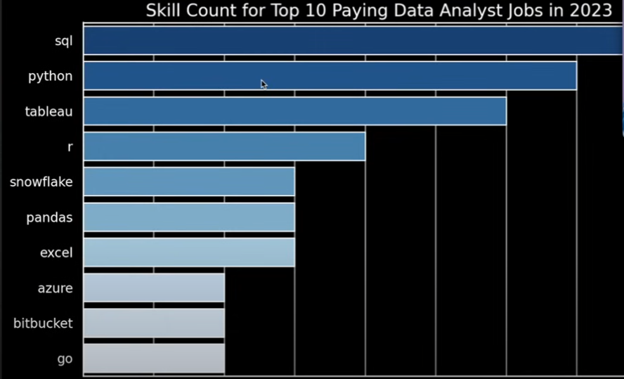

# Introduction
Dive into the data job market. Focus on Data Analyst roles.
Explore top paying jobs, in-demand skills, and find where 
high demand meets high salary.

SQL queries are found here: [project_sql](/project_sql/)

# Background
Learning SQL by following Luke Barousse's YouTube course:
[SQL for Data Analytics](https://www.youtube.com/watch?v=7mz73uXD9DA&t=14138s)

5 questions I want answered:

1. What are the top-paying data analyst jobs?
2. What skills are required for these top-paying jobs?
3. What skills are most in-demand for data analysts?
4. Which skills are associated with higher salaries?
5. What are the most optimal skills to learn?

# Tools I Used
- **SQL**
- **PostgreSQL**
- **VS Code**
- **Git, Github.com, and GitHub Desktop**

# Analysis
### 1. Top paying Data Analyst jobs
SQL query I used:

```
SELECT job_id,
    company_dim.name AS company_name,
    job_title_short,
    job_location,
    job_schedule_type,
    salary_year_avg,
    job_posted_date::DATE
FROM job_postings_fact
LEFT JOIN company_dim ON
    job_postings_fact.company_id = company_dim.company_id
WHERE job_title_short = 'Data Analyst' AND
    job_location = 'Anywhere' AND
    salary_year_avg IS NOT NULL
ORDER BY salary_year_avg DESC
LIMIT 10;
```

Top-Paying Chart:


Top-Paying Table:
```
| Job ID  | Company Name | Job Title   | Location | Schedule  | Salary ($)  | Posted Date |
|-------- |------------ |------------ |----------|---------- |------------ |------------ |
| 226942  | Mantys     | Data Analyst | Anywhere | Full-time | 650,000     | 2023-02-20  |
| 547382  | Meta       | Data Analyst | Anywhere | Full-time | 336,500     | 2023-08-23  |
| 552322  | AT&T       | Data Analyst | Anywhere | Full-time | 255,829.5   | 2023-06-18  |
| 99305   | Pinterest  | Data Analyst | Anywhere | Full-time | 232,423     | 2023-12-05  |
| 1021647 | UCLA Health | Data Analyst | Anywhere | Full-time | 217,000     | 2023-01-17  |
| 168310  | SmartAsset | Data Analyst | Anywhere | Full-time | 205,000     | 2023-08-09  |
| 731368  | Inclusively | Data Analyst | Anywhere | Full-time | 189,309     | 2023-12-07  |
| 310660  | Motional   | Data Analyst | Anywhere | Full-time | 189,000     | 2023-01-05  |
| 1749593 | SmartAsset | Data Analyst | Anywhere | Full-time | 186,000     | 2023-07-11  |
| 387860  | Get It Recruit | Data Analyst | Anywhere | Full-time | 184,000     | 2023-06-09  |
```


# What I Learned
I learned a lot about SQL, VS Code, and GitHub. Some of the more advanced things I learned
about were Joins, Subqueries, CTEs, and adding Markdown Tables.

# Conclusions
I am very thankful to Luke for this very informative course.

